基于SpringBoot的药店管理系统（程序+论文）
=
- 完整代码获取地址：从戎源码网 ([https://armycodes.com/](https://armycodes.com/))
- 作者微信：19941326836  QQ：952045282 
- 承接计算机毕业设计、Java毕业设计、Python毕业设计、深度学习、机器学习
- 选题+开题报告+任务书+程序定制+安装调试+论文+答辩ppt 一条龙服务
- 所有选题地址https://github.com/nature924/allProject

一、项目介绍
---
基于Spring Boot框架实现的药店管理系统，系统包含两种角色：管理员、用户,系统分为前台和后台两大模块，主要功能如下。
### 前台：

首页：展示药店的相关内容。
药品：浏览和搜索药品信息，包括药品名称、价格等。
个人中心：管理个人信息，包括订单记录、个人设置等。

### 后台（管理员）：

个人中心：管理个人信息。
基础数据管理：管理系统中的基础数据。
供应商信息管理：管理药品供应商信息。
药品管理：管理药品信息。
进货管理：管理药品进货信息。
销售管理：管理药品销售信息。
员工管理：管理员工账号信息。

### 员工：

个人中心：管理个人信息，包括订单记录、个人设置等。
供应商信息管理：管理药品供应商信息，包括添加、编辑、删除供应商等操作。
药品管理：管理药品信息，包括添加、编辑、删除药品等操作。
进货管理：管理药品进货信息，包括查看进货记录、录入进货信息等操作。
销售管理：管理药品销售信息，包括查看销售记录、录入销售信息等操作。

二、项目技术
---
- 编程语言：Java
- 数据库：MySQL
- 项目管理工具：Maven
- 前端技术：VUE、HTML、Jquery、Bootstrap
- 后端技术：Spring、SpringMVC、MyBatis

三、运行环境
---
- 操作系统：Windows、macOS都可以
- JDK版本：JDK1.8以上都可以
- 开发工具：IDEA、Ecplise、Myecplise都可以
- 数据库: MySQL5.7以上都可以
- Tomcat：任意版本都可以
- Maven：任意版本都可以

四、运行截图
---
### 论文截图：
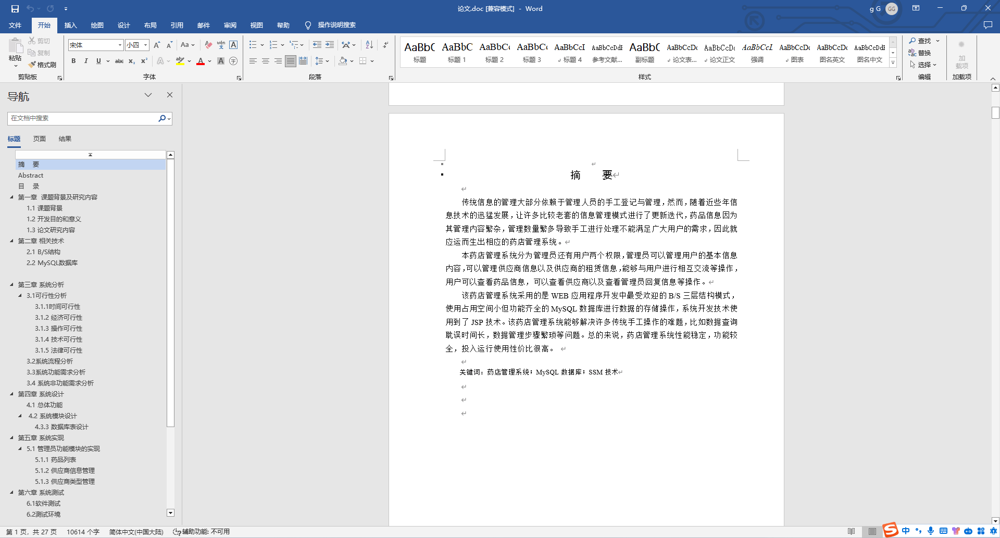
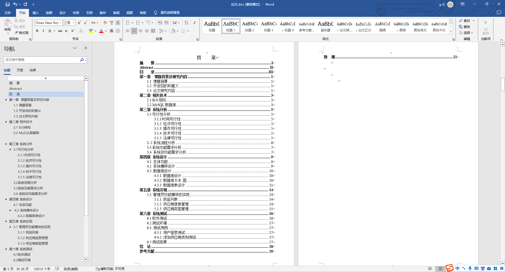

### 程序截图：
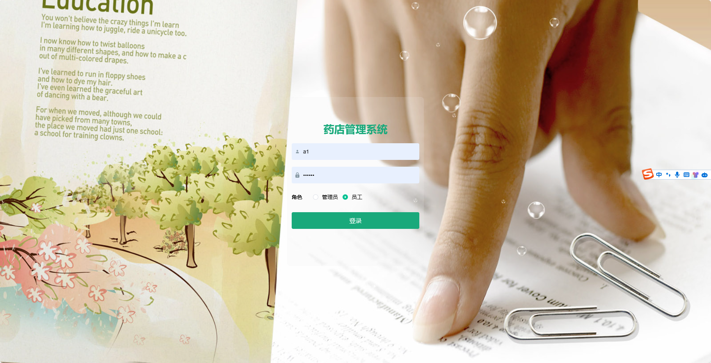
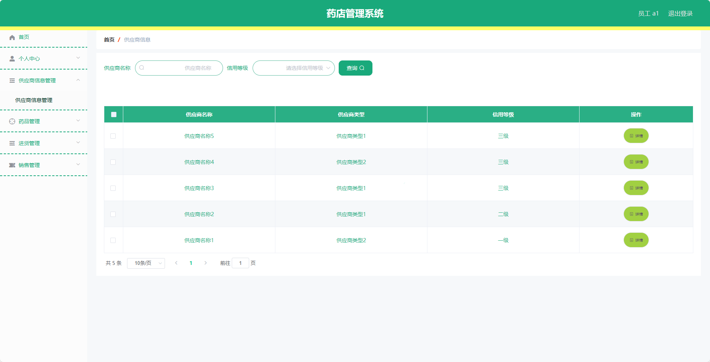
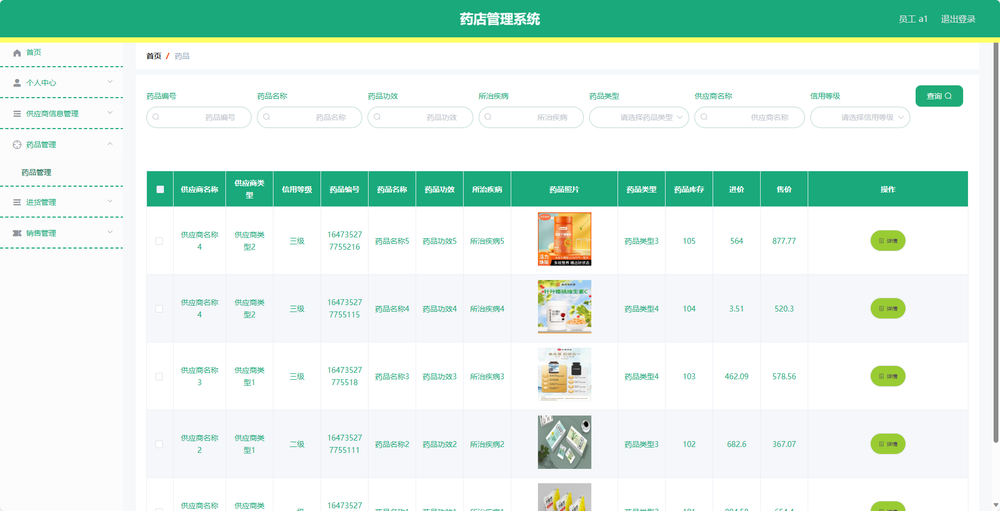
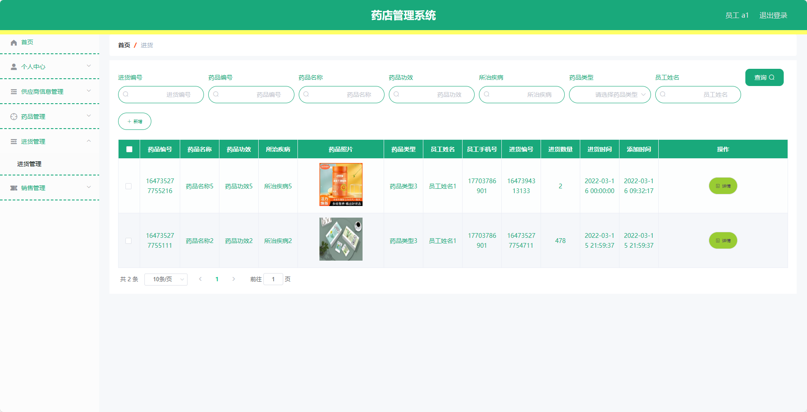
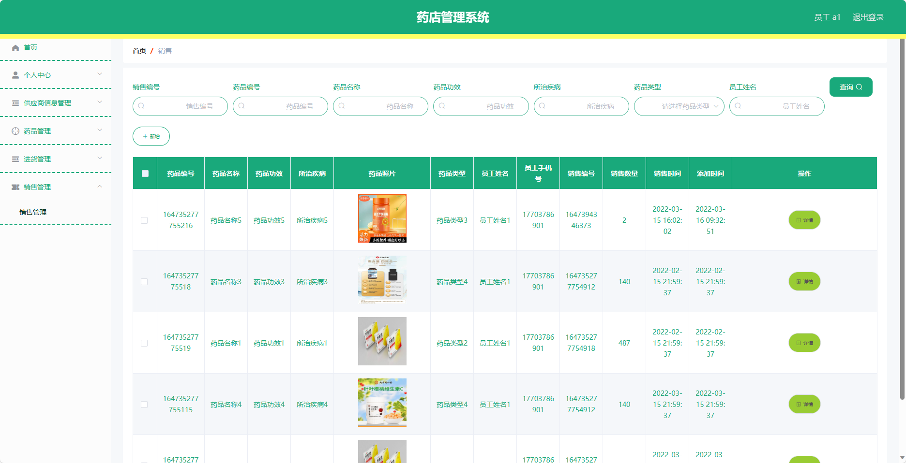
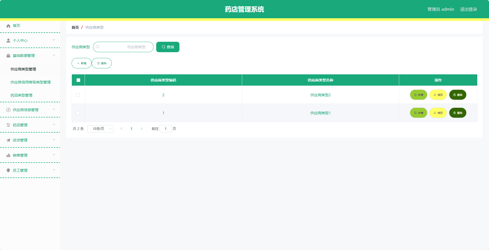
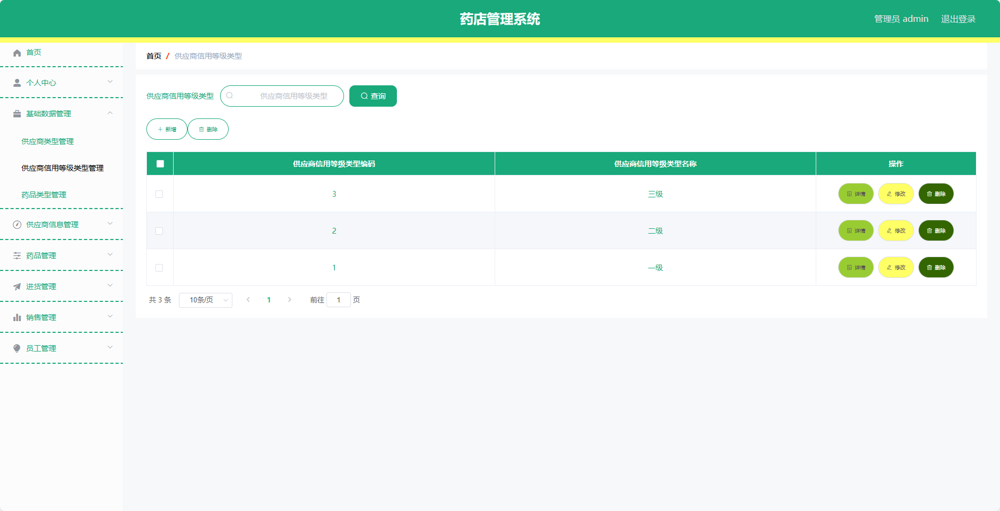
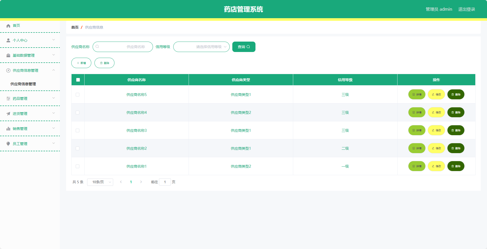
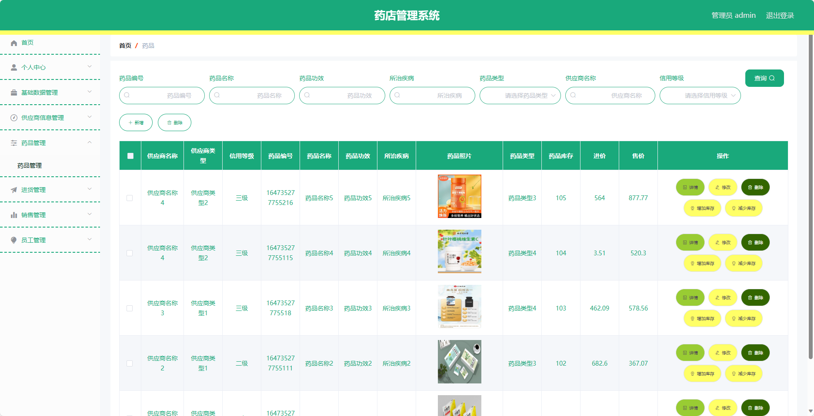
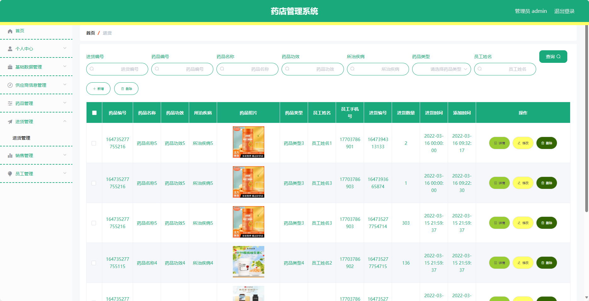

